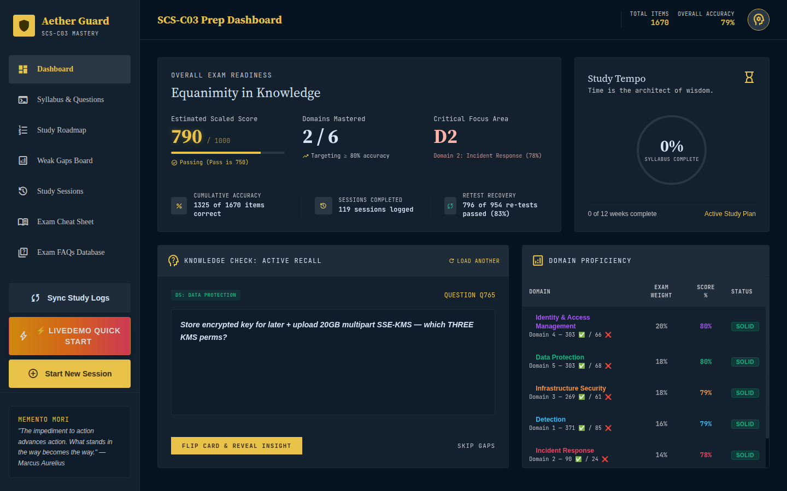

# AWS Certified Security - Specialty (SCS-C03) Study Repository

[](#current-progress) [](#current-progress) [](#current-progress) [](#current-progress)


A structured, depth-first study environment for the **AWS Certified Security - Specialty (SCS-C03)** exam. Built for senior engineers who prefer architectural diagrams and hands-on labs over long text.

> [!TIP]
> **Are you a new user starting fresh?** 🚀
> 
> Use the clean-slate **[onboarding branch](https://github.com/kiquetal/aws-security-speciality-2026/tree/onboarding)** to start with 0% progress and clean, empty template schedules.
>
> To check out the onboarding branch locally:
> ```bash
> git checkout onboarding
> ```



## Table of Contents

- [Exam Snapshot](#exam-snapshot)
- [Current Progress](#current-progress)
- [Domain Weights](#domain-weights)
- [Repository Structure](#repository-structure)
- [Study Approach](#study-approach)
- [What's New in SCS-C03 (vs C02)](#whats-new-in-scs-c03-vs-c02)
- [IAM Policy Conventions](#iam-policy-conventions)
- [Getting Started](#getting-started)

## Exam Snapshot

| Detail | Value |
|--------|-------|
| **Exam** | SCS-C03 (current as of Dec 2025) |
| **Duration** | 170 minutes, 65 questions (50 scored) |
| **Passing Score** | 750 / 1000 |
| **Question Types** | Multiple choice, multiple response, ordering, matching |
| **Cost** | $300 USD |

## Current Progress

| Metric | Value |
|--------|-------|
| **Phase** | Maintenance mode (decay prevention until Aug 27) |
| **Questions Attempted** | 1,670 |
| **Accuracy** | 79% overall, 85-90% on recent sessions |
| **Sessions** | 119 |
| **Study Hours** | 108+ hours |
| **Dojo Mock Scores** | Test 1: 58% → Test 2: 72% (passing) |
| **Never-Seen Topics Tested** | 14/18 (all passed or re-locked) |
| **Weakest Domain** | D2 Incident Response (78%) — all domains within 2% |

## Domain Weights

| Domain | Weight | Status | Score |
|--------|--------|--------|-------|
| D4: Identity and Access Management | 20% | ✅ Complete | 80% |
| D5: Data Protection | 18% | ✅ Complete | 80% |
| D1: Detection | 16% | ✅ Complete | 79% |
| D3: Infrastructure Security | 18% | ✅ Complete | 79% |
| D6: Governance | 14% | ✅ Complete | 79% |
| D2: Incident Response | 14% | ✅ Complete | 78% |

Strategy: All domains covered. Now in maintenance mode — weekly 25-question drills + bi-weekly 65-question Dojo mocks until exam day. See [`notes/maintenance-plan.md`](notes/maintenance-plan.md) for the schedule.

## Repository Structure

```
.
├── study-plan.md                  # Weekly progress tracker (⬜/✅)
├── blueprint.md                   # Full SCS-C03 exam blueprint with task statements
│
├── notes/                         # FAQ-style deep dives per service/topic
│   ├── cheat-sheet.md             #   Exam-day one-liners (wide reference)
│   ├── flashcards-*.md            #   Targeted active-recall cards (narrow, high-impact)
│   │   ├── flashcards-detect-vs-prevent.md   # #1 recurring error pattern
│   │   └── flashcards-guardduty-findings.md  # "U See TRIP-D" mnemonic
│   ├── question-tracker.md        #   Every question attempted, scores, weak areas
│   │
│   ├── faq-iam.md                 #   IAM fundamentals
│   ├── faq-sts.md                 #   STS, AssumeRole, cross-account
│   ├── faq-iam-identity-center.md #   Workforce SSO
│   ├── faq-identity-center.md     #   Identity Center deep dive
│   ├── faq-cognito.md             #   Customer-facing auth
│   ├── faq-verified-permissions.md #  App-level authz (Cedar)
│   ├── faq-abac.md                #   ABAC tag patterns
│   ├── faq-permission-boundaries.md # Delegation pattern
│   ├── faq-kms.md                 #   Key types, grants, rotation matrix
│   ├── faq-s3.md                  #   Encryption, bucket policies, access points
│   ├── faq-secrets-manager.md     #   Rotation, managed vs custom
│   ├── faq-guardduty.md           #   Threat detection, protection plans
│   ├── faq-access-analyzer.md     #   External access + unused access
│   ├── faq-cloudtrail.md          #   Event types, Lake vs S3+Athena, selectors
│   ├── faq-security-lake.md       #   OCSF format, your S3 bucket
│   ├── faq-waf-shield.md          #   WAF rules, Shield Advanced
│   ├── faq-network-firewall.md    #   IDS/IPS, Suricata, TLS inspection
│   ├── faq-route53-resolver.md    #   DNS Firewall, Resolver Query Logs
│   ├── faq-aws-firewalls-compared.md # All 5 firewalls side-by-side
│   ├── faq-cloudfront-oac.md      #   OAC vs OAI, SSE-KMS integration
│   ├── faq-session-manager.md     #   No-SSH admin access, logging layers
│   ├── faq-hybrid-connectivity.md #   DX, MACsec, VPN, Verified Access
│   ├── faq-organizations.md       #   SCPs, account structure
│   ├── faq-rcp.md                 #   Resource Control Policies (new in C03)
│   ├── faq-ram-vs-rcp.md          #   RAM sharing vs RCP restricting
│   ├── faq-detect-vs-prevent.md   #   Verb-based service selection
│   ├── faq-data-masking.md        #   CW Logs + SNS data protection (new in C03)
│   ├── faq-nitro-encryption.md    #   Inter-instance encryption (new in C03)
│   ├── faq-genai-owasp.md         #   Bedrock Guardrails (new in C03)
│   ├── faq-acm-private-ca.md      #   Private CA, cross-region certs
│   ├── faq-fis-resilience-hub.md  #   Chaos engineering + resilience assessment
│   ├── faq-security-services-comparison.md  # GuardDuty vs Macie vs Inspector vs Config
│   ├── security-services-map.md   #   Full detection → aggregation → response pipeline
│   ├── policy-layers-reference.md #   The 5 gates: SCP → RCP → boundary → identity → resource
│   ├── iam-overview.md            #   IAM core concepts overview
│   ├── attack-roadmap.md          #   Depth-first study order by difficulty tier
│   ├── new-must-know-for-c03.md   #   7 topics with no C02 precedent
│   ├── scs-c03-appendix-b-changes.md  # C02 → C03 recategorization analysis
│   └── course/                    #   Video catalog + watch plan
│       ├── video-catalog.md
│       └── README.md
│
├── diagrams/                      # Mermaid source (.mmd) + rendered PNGs
│   ├── policy-evaluation-with-rcps.*
│   ├── iam-policy-evaluation-boundaries.*
│   ├── iam-roles-sequence.png
│   ├── security-services-comparison.*
│   ├── security-services-complete-map.*
│   ├── cross-account-s3-kms.*
│   ├── kms-grants-cross-account.*
│   ├── cloudfront-oac.*
│   ├── session-manager-logging.*
│   ├── session-manager-vpc-endpoints.*
│   ├── route53-dns-firewall.*
│   ├── guardduty-org-setup.*
│   ├── kms-access-control-myths.*
│   ├── study-plan-gantt.png
│   ├── aws-policy-5-gates-tldraw.png
│   ├── s3-object-lock-tldraw.png
│   ├── kms-key-types-tldraw.png
│   ├── traffic-inspection-tldraw.png
│   └── log-destinations-tldraw.png
│
├── examples/                      # Production-ready policy JSON + CLI examples
│   ├── index.md                   #   Examples organized by domain
│   ├── iam-policy-examples.md     #   Identity, resource, boundary, SCP, trust, RCP policies
│   └── cross-account-s3-kms.md    #   Three-policy cross-account pattern
│
├── labs/                          # Hands-on challenges (Terraform/CLI)
│   └── iam-s3-readonly-challenge/ #   S3 read-only + IP restriction lab
│
├── scripts/
│   └── update-tracker.py          # Regenerates question-tracker.md summary sections
│
└── aws-incident-response-demonstrated-microcredential/
    └── README.md                  # Separate IR microcredential prep
```

## Study Approach

Each week follows this rhythm:

1. **FAQ notes** — encryption, logging, IAM permissions, quotas, exam gotchas (skip basic definitions)
2. **Mermaid diagrams** — architectural flows for key patterns
3. **Hands-on lab** — Terraform/CLI challenge in a sandbox account
4. **Scenario quiz** — 10+ exam-style questions per domain
5. **Review** — update [`question-tracker.md`](notes/question-tracker.md), fill gaps

### Flashcards vs Cheat Sheet

| Tool | Purpose | When to use |
|------|---------|-------------|
| `cheat-sheet.md` | Wide reference — all one-liners across all domains | Final review, exam-day refresh |
| `flashcards-*.md` | Narrow, targeted — one recurring error pattern per file | Active recall during study, before each session |

Flashcards are created when a concept is missed **2+ times**. They include self-test questions with hidden answers for active recall practice.

### Completion Criteria

A week is complete when: FAQ notes exist, ≥1 diagram created, ≥1 lab done, ≥80% on quiz, weak areas documented.

## What's New in SCS-C03 (vs C02)

These 7 topics have no C02 precedent — exam writers will test them as differentiators:

| # | Topic | Task | Status |
|---|-------|------|--------|
| 1 | Resource Control Policies (RCPs) | 6.1 | ✅ Deep dive |
| 2 | GenAI OWASP Top 10 | 3.2.7 | ✅ Deep dive |
| 3 | OCSF / Security Lake | 3.1.4 | ✅ Deep dive |
| 4 | Data masking (CloudWatch Logs + SNS) | 5.3.4 | ✅ Deep dive |
| 5 | Nitro inter-instance encryption | 5.1.3 | ✅ Deep dive |
| 6 | Imported key material differences | 5.3.3 | ✅ Deep dive |
| 7 | Multi-Region Keys + Private CA | 5.3.5 | ✅ Deep dive |

See [`notes/new-must-know-for-c03.md`](notes/new-must-know-for-c03.md) and [`notes/scs-c03-appendix-b-changes.md`](notes/scs-c03-appendix-b-changes.md) for the full analysis.

## IAM Policy Conventions

All policies in this repo follow exam best practices:

- `"Version": "2012-10-17"` — always
- Specific actions — never `Action: *`
- Specific resource ARNs — never `Resource: *` for data operations
- Conditions — `aws:SourceIp`, `aws:MultiFactorAuthPresent`, `aws:PrincipalOrgID`
- Explicit deny for guardrails
- `Sid` on every statement

## Getting Started

1. Check your current week in [`study-plan.md`](study-plan.md)
2. Read the matching domain tasks in [`blueprint.md`](blueprint.md)
3. Review existing notes in `notes/` and identify gaps
4. Check [`notes/question-tracker.md`](notes/question-tracker.md) for weak areas to re-test
5. Review `notes/flashcards-*.md` for active recall on recurring errors
6. Follow the weekly rhythm above

## Interactive Live Demo & Local Study Portal

You can experience the AWS Certified Security - Specialty study portal in two ways: via the **Browser-Isolated Live Demo** or the **Local Study Portal & Live Sync** server.

### 🌐 Option A: Hosted Browser-Isolated Live Demo
Try the interactive study portal instantly without installing anything locally:
*   **Live Demo URL**: **[https://kiquetal.dev/aws-security-speciality-2026/](https://kiquetal.dev/aws-security-speciality-2026/)** *(Alternative: [https://kiquetal.github.io/aws-security-speciality-2026/](https://kiquetal.github.io/aws-security-speciality-2026/))*
*   **Pure Static Sandbox Mode**: In this hosted environment, there is no Python backend server to write files on your disk. To prevent confusion and ensure clear boundaries, non-isolated actions (such as **Start New Session** and **Sync Study Logs**) are **fully blocked and disabled from the start**.
*   **How to Run the Demo**:
    1. Click the pulsing **⚡ LIVEDEMO Quick Start** button in the sidebar.
    2. It will instantly pre-charge an isolated simulation session with **6 realistic scenario questions** in your browser's local memory and open the interactive carousel on Question 1.
    3. Select your options (A, B, C, D) and click **Record & Save** to see your stats update in real-time!
    4. Click **Reset Live Demo** in the sidebar at any time to clear the browser memory and start fresh.

### 💻 Option B: Local Study Portal & Live Sync (Recommended for Personal Study)
For active daily studying, run the portal locally on your machine to save your practice drills and record actual study records directly to disk:
1. Start the portal server with:
   ```bash
   ./run_server.sh
   ```
2. Open `http://localhost:8188` in your web browser.
3. In local study mode, clicking **Start New Session** appends custom study tables directly to your local file [`notes/question-tracker.md`](notes/question-tracker.md).
4. Select your answer choices dynamically in the browser, click **Record & Save to Disk**, and the local Python server will physically write your selections and results back to your hard drive, instantly updating your dashboard!
5. Click **Sync Study Logs** on the sidebar to trigger manual statistics recompilation and keep your portal perfectly synced with your markdown records.
