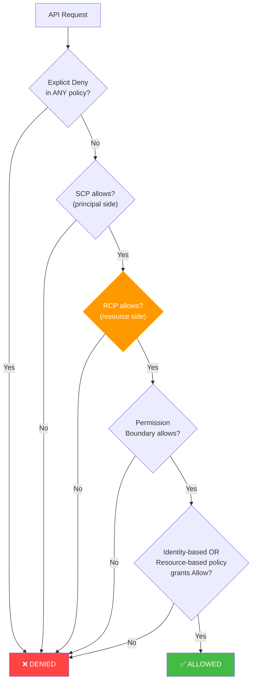
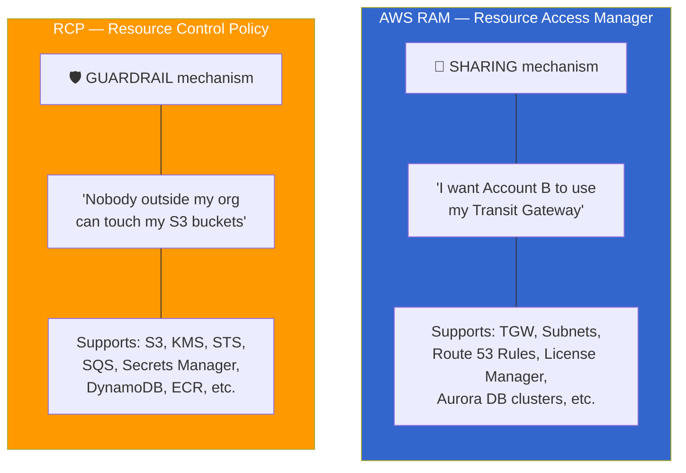
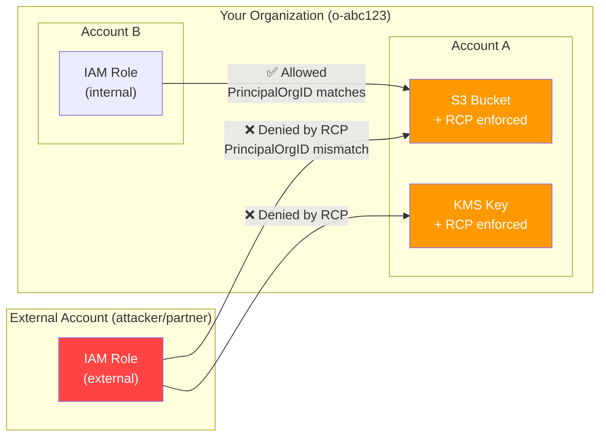

# FAQ: Resource Control Policies (RCPs)

> **Blueprint refs:** Task 6.1 (centrally deploy/manage accounts), Task 4.2 (authorization strategies)
> **Launched:** November 2024 — new for SCS-C03

## What Problem Do RCPs Solve?

SCPs are **principal-centric** — they restrict what IAM users/roles *inside* your org can do.
RCPs are **resource-centric** — they restrict what *anyone* (internal or external) can do *to resources* in your org.

**The gap SCPs leave open:** If a developer attaches a permissive resource-based policy (e.g., S3 bucket policy granting `Principal: "*"`), an external principal calling from *their own account* bypasses your SCPs entirely. SCPs only govern your principals, not theirs.

RCPs close this gap by enforcing a permissions ceiling on the **resource itself**, regardless of who the caller is.

## How RCPs Fit in Policy Evaluation



**Effective permissions = SCP ∩ RCP ∩ (Identity policy ∪ Resource policy) ∩ Permission Boundary**

## SCP vs RCP — Side-by-Side

| Dimension | SCP | RCP |
|---|---|---|
| **Controls** | Principals (IAM users/roles) | Resources (S3, KMS, STS, SQS, etc.) |
| **Affects root user?** | ✅ Yes (member accounts) | ✅ Yes (member account resources) |
| **Affects management account?** | ❌ No | ❌ No (resources in mgmt account exempt) |
| **Affects external principals?** | ❌ No — only your org's principals | ✅ Yes — evaluated on resource regardless of caller |
| **Affects service-linked roles?** | ✅ Yes | ❌ No — SLRs are exempt |
| **Affects AWS managed KMS keys?** | ✅ Yes | ❌ No — only customer managed keys |
| **Max size** | 5,120 characters | 5,120 characters |
| **Max per target** | 5 | 5 |
| **Max per org** | 1,000 | 1,000 |
| **Default policy** | `FullAWSAccess` | `RCPFullAWSAccess` |
| **Grants permissions?** | ❌ Never | ❌ Never |
| **Primary use case** | Restrict what your people can do | Restrict who can touch your data (data perimeter) |

## RAM vs RCP — Don't Confuse Them

These solve completely different problems despite both involving cross-account resource access.



| Dimension | RAM | RCP |
|---|---|---|
| **Purpose** | Share resources across accounts | Restrict access to resources |
| **Grants access?** | ✅ Yes — creates cross-account permissions | ❌ Never — only restricts |
| **Scope** | Specific resources → specific accounts | Org-wide ceiling on all callers |
| **Where it lives** | Per-account resource shares | AWS Organizations policy |
| **Supported services** | TGW, subnets, Route 53 rules, Aurora, License Manager, etc. | S3, KMS, STS, SQS, Secrets Manager, etc. |
| **Service overlap?** | Almost none — different service lists | Almost none |
| **Blueprint ref** | Task 6.2 (cross-account resource sharing) | Task 6.1 (org policy management) |

> **Exam scenario:** "Share a Transit Gateway with a dev account AND ensure no S3 bucket can be accessed outside the org." → **RAM** for TGW sharing, **RCP** for S3 data perimeter. They complement each other, not alternatives.

> **Gotcha:** RAM *can* be restricted by SCPs (SCP-deny `ram:CreateResourceShare` with external principals), but that's an SCP controlling RAM, not an RCP.

## Supported Services (Exam-Critical — Limited List!)

RCPs only apply to a **subset** of AWS services. Key ones for the exam:

| Service | Why It Matters |
|---|---|
| **Amazon S3** | Data perimeter — prevent external bucket access |
| **AWS STS** | Prevent external role assumption into your accounts |
| **AWS KMS** | Prevent external decryption of your keys |
| **Amazon SQS** | Prevent external queue access |
| **AWS Secrets Manager** | Prevent external secret retrieval |
| **Amazon Cognito** | Protect identity pools |
| **CloudWatch Logs** | Protect log groups |
| **Amazon DynamoDB** | Protect table access |
| **Amazon ECR** | Protect container image pulls |

**Not supported (yet):** EC2, RDS, Lambda, IAM, SNS, EBS, EFS, and many others.

> ⚠️ **Exam gotcha:** If a question asks about restricting external access to a service NOT on this list, RCPs won't help — you need resource-based policies or SCPs.

## Key Limits/Quotas

- **5,120 characters** max per RCP (same as SCP)
- **5 RCPs** max attached per target (root, OU, or account)
- **1,000 RCPs** max stored per organization
- Requires **all features** enabled in Organizations (not consolidated billing only)
- **No cost** — free to enable and use

## Exam Gotchas

### What RCPs Do NOT Restrict
1. **Management account resources** — completely exempt
2. **Service-linked roles (SLRs)** — exempt (AWS services need them to function)
3. **AWS managed KMS keys** (`aws/s3`, `aws/ebs`, etc.) — exempt
4. **`kms:RetireGrant`** — specifically exempt
5. **Delegated admin accounts are NOT exempt** — RCPs apply to them (unlike management account)

### RCPs Don't Prevent Saving Permissive Policies
A developer CAN still save a bucket policy with `Principal: "*"`. The RCP doesn't block the `PutBucketPolicy` call. It blocks the *subsequent access* by external principals at evaluation time.

### Default RCP: `RCPFullAWSAccess`
- Auto-attached to root, every OU, every account when RCPs are enabled
- Allows all principals, all actions, all resources
- **Do NOT detach** without a replacement — empty RCP = deny all (same behavior as SCPs)

### RCPs Use Deny Statements
- The default `RCPFullAWSAccess` is the only Allow
- You add **Deny** statements to restrict — same pattern as SCPs
- All conditions must evaluate to `true` for the Deny to apply

### Cross-Account Access Pattern
- **Same-org cross-account:** RCP checks the *resource account's* RCP chain, not the caller's
- **External cross-account:** RCP on resource account blocks external principals unless conditions allow

### Inheritance
- RCPs inherit down: root → OU → nested OU → account
- Resource must satisfy **every** RCP in its ancestor chain
- More restrictive as you go deeper (same as SCPs)

## Data Perimeter — The Core RCP Use Case



## Example RCPs (Exam-Style)

### Example 1: Restrict S3 Access to Org Principals Only

```json
{
  "Version": "2012-10-17",
  "Statement": [
    {
      "Sid": "EnforceS3OrgIdentitiesOnly",
      "Effect": "Deny",
      "Principal": "*",
      "Action": "s3:*",
      "Resource": "*",
      "Condition": {
        "StringNotEqualsIfExists": {
          "aws:PrincipalOrgID": "o-abc123def4"
        },
        "BoolIfExists": {
          "aws:PrincipalIsAWSService": "false"
        }
      }
    }
  ]
}
```

**Why two conditions (both must be true to deny):**
1. `StringNotEqualsIfExists` — caller is NOT in our org
2. `BoolIfExists` — caller is NOT an AWS service (CloudTrail, Config, etc. need access)

> ⚠️ Without the `aws:PrincipalIsAWSService` exception, you'd block AWS services like CloudTrail writing to your S3 bucket.

### Example 2: Restrict KMS Key Usage to Org Only

```json
{
  "Version": "2012-10-17",
  "Statement": [
    {
      "Sid": "EnforceKMSOrgIdentitiesOnly",
      "Effect": "Deny",
      "Principal": "*",
      "Action": [
        "kms:Decrypt",
        "kms:Encrypt",
        "kms:ReEncryptFrom",
        "kms:ReEncryptTo",
        "kms:GenerateDataKey",
        "kms:GenerateDataKeyWithoutPlaintext",
        "kms:DescribeKey",
        "kms:CreateGrant"
      ],
      "Resource": "*",
      "Condition": {
        "StringNotEqualsIfExists": {
          "aws:PrincipalOrgID": "o-abc123def4"
        },
        "BoolIfExists": {
          "aws:PrincipalIsAWSService": "false"
        }
      }
    }
  ]
}
```

**Key point:** This only affects **customer managed keys**. AWS managed keys (`aws/s3`, `aws/ebs`) are exempt from RCPs.

### Example 3: Prevent External STS Role Assumption

```json
{
  "Version": "2012-10-17",
  "Statement": [
    {
      "Sid": "EnforceSTSOrgIdentitiesOnly",
      "Effect": "Deny",
      "Principal": "*",
      "Action": "sts:AssumeRole",
      "Resource": "*",
      "Condition": {
        "StringNotEqualsIfExists": {
          "aws:PrincipalOrgID": "o-abc123def4"
        },
        "BoolIfExists": {
          "aws:PrincipalIsAWSService": "false"
        }
      }
    }
  ]
}
```

**Use case:** Even if a trust policy on a role allows an external account, this RCP blocks the assumption.

## RCP Condition Key Patterns

| Condition Key | Purpose |
|---|---|
| `aws:PrincipalOrgID` | Restrict to callers in your org |
| `aws:PrincipalIsAWSService` | Exempt AWS service principals (CloudTrail, Config, etc.) |
| `aws:PrincipalAccount` | Restrict to specific account(s) |
| `aws:SourceOrgID` | Restrict by source org (for service-to-service calls) |
| `aws:PrincipalOrgPaths` | Restrict to specific OUs within your org |

> **Exam tip:** `IfExists` variants are critical. If the condition key is absent from the request context, `StringNotEqualsIfExists` evaluates to `true` (no-op), avoiding accidental denials for requests that don't carry org context.

## RCP Syntax Rules

- **`Principal` must always be `"*"`** — use Conditions to scope, not Principal
- **Only `Deny` and `Allow` effects** — but in practice you only write `Deny` (the default `RCPFullAWSAccess` handles Allow)
- **`Resource` is typically `"*"`** — scoped by the service actions
- **No `NotPrincipal`** — not supported in RCPs
- Standard IAM policy JSON otherwise (Version, Statement, Sid, Effect, Action, Resource, Condition)

## Testing RCPs

1. **Start with a single test account** — never attach to root first
2. **Check CloudTrail** for `Access Denied` errors after attachment
3. **Use IAM Access Analyzer** external access findings to understand current exposure before writing RCPs
4. **Move up gradually:** test account → test OU → broader OUs → root

## Integration with Control Tower

- Control Tower supports **RCP-based controls** alongside SCP-based controls
- Drift detection: alerts if RCPs are modified outside Control Tower
- Deploy via Control Tower for consistent governance at scale

## Best Practices

1. **Use RCPs + SCPs together** — defense in depth (principal side + resource side)
2. **Always exempt AWS service principals** — `aws:PrincipalIsAWSService` condition
3. **Start with S3, KMS, STS** — highest-impact data perimeter services
4. **Test in non-production** before org-wide rollout
5. **Monitor with CloudTrail** — track RCP-related denials
6. **Use `IfExists` condition operators** — avoid breaking requests without org context
7. **Don't detach `RCPFullAWSAccess`** without understanding the impact
8. **Version control RCPs in git** — same as SCPs
