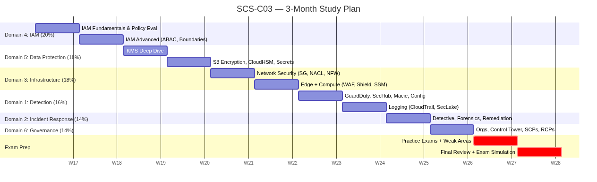

# AWS SCS-C03 — 3-Month Study Plan

## Overview
- **Exam:** AWS Certified Security - Specialty (SCS-C03)
- **Target:** ~12 topics (self-paced, no calendar deadlines)
- **Passing Score:** 750/1000
- **Strategy:** Domain-weighted study → Hands-on labs → Exam simulation

## Progress Tracker

| Week | Domain / Focus | Status | Notes |
|------|---------------|--------|-------|
| 1 | D4: IAM fundamentals, policy evaluation logic | ⬜ | |
| 2 | D4: IAM advanced (ABAC, boundaries, cross-account, Verified Permissions) | ⬜ | |
| 3 | D5: KMS (key types, grants, policies, multi-region) | ⬜ | |
| 4 | D5: Data protection (S3 encryption, CloudHSM, Secrets Manager, ACM) | ⬜ | |
| 5 | D3: Network security (SGs, NACLs, Network Firewall, VPC endpoints) | ⬜ | |
| 6 | D3: Edge security (WAF, Shield, CloudFront) + Compute (Inspector, SSM) | ⬜ | |
| 7 | D1: Detection (GuardDuty, Security Hub, Macie, Config) | ⬜ | |
| 8 | D1: Logging (CloudTrail, CloudWatch, Security Lake, Athena) | ⬜ | |
| 9 | D2: Incident Response (Detective, forensics, remediation, Step Functions) | ⬜ | |
| 10 | D6: Governance (Organizations, Control Tower, SCPs, RCPs, Firewall Manager) | ⬜ | |
| 11 | Full practice exams + weak-area deep dives | ⬜ | |
| 12 | Final review, exam simulations, confidence check | ⬜ | |

## Weekly Rhythm

Each topic follows this pattern (at your own pace):
1. Read/create FAQ notes for the topic's services
2. Build architectural diagrams (Mermaid) for key flows
3. Hands-on lab (Terraform/CLI challenge)
4. Scenario-based quiz (exam-style questions, 10+ per domain)
5. Review mistakes, fill gaps, update notes
6. Mark topic ✅ when completion criteria met

## Domain Weight Alignment

The plan front-loads the heaviest domains:
- **Weeks 1-2:** Domain 4 — IAM (20%) ← highest weight
- **Weeks 3-4:** Domain 5 — Data Protection (18%)
- **Weeks 5-6:** Domain 3 — Infrastructure Security (18%)
- **Weeks 7-8:** Domain 1 — Detection (16%)
- **Week 9:** Domain 2 — Incident Response (14%)
- **Week 10:** Domain 6 — Governance (14%)
- **Weeks 11-12:** Cross-domain review + exam simulation

## Completion Criteria per Week

A week is ✅ complete when:
- [ ] FAQ notes exist for all key services of that domain
- [ ] At least 1 architectural diagram created
- [ ] At least 1 hands-on lab completed
- [ ] Scored ≥80% on scenario-based quiz (10+ questions)
- [ ] Weak areas documented in notes

## IAM Policy JSON Best Practices (Exam Critical)

When writing or reviewing IAM policies:
1. **Use `"Version": "2012-10-17"`** — always include the latest policy version
2. **Specific actions** — never use `"Action": "*"`, list exact actions
3. **Specific resources** — use full ARNs, never `"Resource": "*"` for data operations
4. **Add conditions** — `aws:SourceIp`, `aws:MultiFactorAuthPresent`, `aws:PrincipalOrgID`
5. **Explicit deny** — use deny statements for critical guardrails (they always win)
6. **Sid for readability** — name each statement for audit clarity
7. **Validate** — always test with IAM Policy Simulator or Access Analyzer
